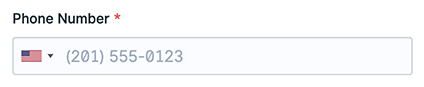
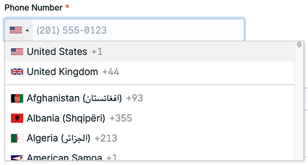
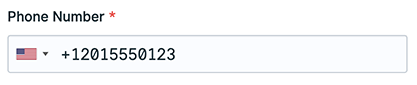
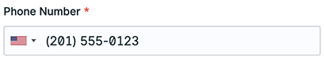

# Statamic Phone Number Fieldtype

> Statamic Phone Number Fieldtype is a Statamic addon that is everything you need to store and display Phone Numbers on your site.

## Features

- A Phone Number Fieldtype that uses the [International Telephone Input](https://intl-tel-input.com/).
  - Phone numbers will be saved in [E164 format](https://www.twilio.com/docs/glossary/what-e164), the international standard.
  - A Country select.
    - A user can select a country and then start entering their number in their national format.
    - A user can also start entering a phone number in international format and the country will automatically be selected in the country select.
  - Hide the country select.
  - Set an **initial country**.
  - Set **preferred countries** to be displayed in the country select.
  - **Exclude countries** from the country select.
  - Set the **only countries** to be listed in the country select.
- Modifiers
  - **e164_to_national** will change the E164 formatted phone number into the national format.
  - **e164_to_international** will change the E164 formatted phone number into the international format.

## How to Install

You can search for this addon in the `Tools > Addons` section of the Statamic control panel and click **install**, or run the following command from your project root:

```bash
composer require kadegray/statamic-phone-number-fieldtype
```

## How to Use

### Phone Number Fieldtype

After adding the Phone Number Fieldtype to your blueprint, when edited an entry it will display as an [International Telephone Input](https://intl-tel-input.com/).



The country select will look like this when it is opened:



When a user types in the input 2015550123, the fieldtype will automatically format it in E164 format +12015550123, +1 is the country code. The phone number will be saved to the entry in E164 format.



You will notice that if you reload the page, after saving the entry, it will format the number in the national format. This is fine, it knows how to handle international and national numbers based on the country selected.



#### Fieldtype Configuration

When you edit the Fieldtype you can configure these:

- `Show Country Select` - Toggle display of the Country select.
- `Initial Country` - Set an initial Country.
- `Preferred Countries` - Set preferred Countries to display at the top in the Countries select.
- `Exclude Countries` - Set Countries to exclude from the Countries select.
- `Only Countries` - Set the only Countries to display in the Countries select.

### Modifiers

If you named the field handle `phone_number` then you can render the original stored E164 formatted value with:

```
{{ phone_number }}
{{ australia_phone_number }}
```

**+12015550123**  
**+61412345678**

However, you probably want to render the number in the national format. For this you can use the modifier `e164_to_national`:

```
{{ phone_number | e164_to_national }}
{{ australia_phone_number | e164_to_national }}
```

**(201) 555-0123**  
**0412 345 678**

You might also like to render the in a nicer international format using `e164_to_international`.

```
{{ phone_number | e164_to_international }}
{{ australia_phone_number | e164_to_international }}
```

**+1 201-555-0123**  
**+61 412 345 678**
